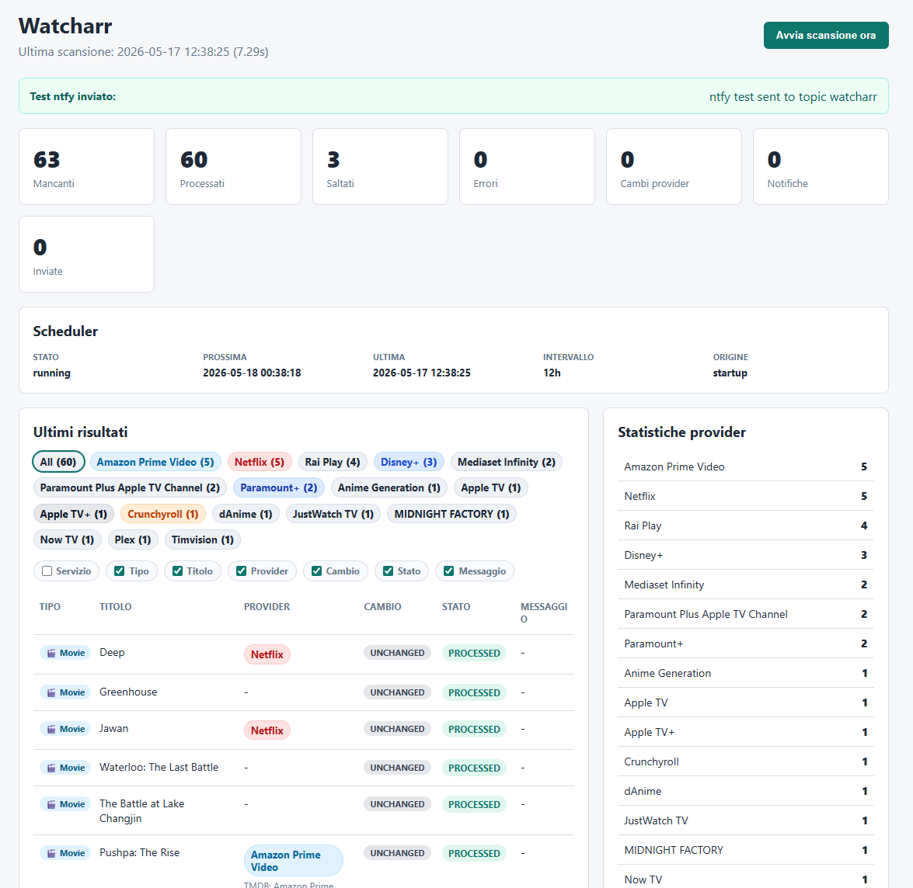

# Watcharr

Streaming availability tracker for Radarr & Sonarr

Lightweight service that checks missing/monitored items in Radarr and Sonarr, looks up streaming availability via TMDB watch providers, and optionally tags items / notifies you when providers change.


[](https://github.com/gipasoft/watcharr/actions)

Quick value proposition: scan your Radarr/Sonarr library, track which titles are available on streaming providers (via TMDB), and apply automatic tagging and notifications.

---

**Dashboard Preview**




---

## Features

- Radarr integration (uses `tmdbId` from movies)
- Sonarr integration (resolves `tmdbId` or `tvdbId` via TMDB)
- TMDB watch providers lookup (country configurable)
- Provider normalization (canonical names for cleaner tags/stats)
- SQLite cache & history for scan diffs and notifications
- ntfy notifications when providers change
- Responsive web dashboard for scan results and scheduler state
- Automatic scheduler (APScheduler) with manual scan button
- Provider filtering and automatic tagging

## Quick Start

1. Copy the example environment and edit values:

```bash
cp .env.example .env
# edit .env and set RADARR_API_KEY, TMDB_BEARER_TOKEN, etc.
```

2. Start with Docker Compose:

```bash
docker compose up -d
```

3. Open the web UI:

```text
http://localhost:8080
```

4. To actually apply tags (default is dry-run):

```env
DRY_RUN=false
```

### Important environment variables

```env
RADARR_URL=http://radarr:7878
RADARR_API_KEY=xxx

SONARR_URL=http://sonarr:8989
SONARR_API_KEY=xxx

TMDB_BEARER_TOKEN=xxx
COUNTRY=IT

DRY_RUN=true
REMOVE_STALE_TAGS=true
TAG_GENERIC=true
TAG_PROVIDERS=true
GENERIC_TAG=available-streaming
DATABASE_PATH=/data/watcharr.sqlite
SCAN_INTERVAL_HOURS=12
RUN_SCAN_ON_STARTUP=true

NTFY_URL=https://ntfy.sh
NTFY_TOPIC=streaming-alerts
NTFY_PRIORITY=default
NTFY_TAGS=tv,streaming
```

## Persistence (SQLite)

On startup the service will create the required SQLite tables if missing:

- `availability_cache`
- `notification_history`
- `scan_history`

The cache compares providers from the last scan and records a history entry only when a new (not-yet-notified) state is detected.

## Scheduler

When run as the web container `watcharr` stays running and runs scheduled scans via APScheduler.

```env
SCAN_INTERVAL_HOURS=12
RUN_SCAN_ON_STARTUP=true
```

The dashboard shows scheduler status, next run and last run. A manual scan button uses the same lock as automatic scans so runs do not overlap.

Scan results show content type (`movie` / `series`) and provider change state: `NEW`, `UPDATED`, `UNCHANGED`, `REMOVED`.

## Provider normalization

TMDB provider names are normalized to canonical names before tagging, caching and statistics. Examples:

- `Amazon Prime Video with Ads` -> `Amazon Prime Video`
- `Prime Video` -> `Amazon Prime Video`
- `Apple TV Amazon Channel` -> `Apple TV+`

The UI also keeps the original TMDB name as a debug detail when it differs.

## ntfy notifications

Notifications are optional. They are sent only when providers change compared to the known SQLite cache; the first scan creates the baseline and does not notify.

For ntfy.sh or a self-hosted ntfy server:

```env
NTFY_URL=https://ntfy.example.com
NTFY_TOPIC=streaming-alerts
NTFY_PRIORITY=high
NTFY_TAGS=tv,streaming
```

If the server requires auth you can use a bearer token:

```env
NTFY_TOKEN=xxx
```

or basic auth:

```env
NTFY_USERNAME=utente
NTFY_PASSWORD=password
```

## Notes on IDs

- Radarr: uses `tmdbId` present on the movie entity.
- Sonarr: uses `tmdbId` when available, otherwise attempts `/find/{tvdbId}?external_source=tvdb_id` on TMDB.

## Recommended first test

1. Keep `DRY_RUN=true`.
2. Start the container.
3. Check logs and dashboard.
4. Switch `DRY_RUN=false` when you are ready to apply tags.

## Architecture

Simple flow:

```
Radarr/Sonarr
      ↓
   Watcharr
      ↓
 TMDB Providers
      ↓
SQLite + ntfy + UI
```

## Disclaimer

- Watcharr does not provide or host streaming content.
- It only tracks and surfaces streaming availability metadata from TMDB watch providers.

## Roadmap

- [x] Radarr integration
- [x] Sonarr integration
- [x] TMDB watch providers lookup
- [x] Provider normalization
- [x] SQLite cache / history
- [x] ntfy notifications
- [x] Responsive dashboard
- [x] Automatic scheduler
- [x] Provider filters
- [x] Automatic tagging

Planned:

- [ ] UI authentication / user preferences
- [ ] Additional provider sources (e.g., JustWatch)
- [ ] Export / API for integrations

## Development

- Run unit tests:

```bash
python -m unittest discover -s tests
```

- Run the CLI locally:

```bash
python -m watcharr
```

- Run a one-off scan in the container:

```bash
docker compose run --rm watcharr python -m watcharr
```

- Project layout (top-level):

- `app/` - application package
- `app/watcharr/clients` - external API clients (Radarr, Sonarr, TMDB)
- `app/watcharr/core` - config, mappings, tags
- `app/watcharr/services` - scanning, scheduling, notifications
- `app/watcharr/storage` - SQLite storage
- `app/watcharr/web` - web UI
- `tests/` - unit tests

If you want me to also add a short CONTRIBUTING section or example GitHub Actions badge link replacement, I can update that next.
